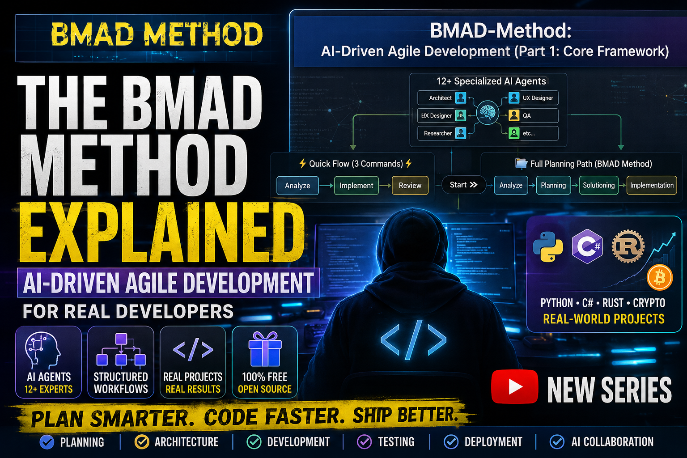

# What is BMAD — Full Video Script

**Video Title:** "0️⃣ The BMAD Method Explained — AI‑Driven Agile Development for Real Developers"

**Duration:** ~6-10 minutes
**Target Audience:** Python beginners through intermediate developers

---

## 🎯 INTRO

"Welcome back to the channel!

Today we're diving into something powerful — the BMAD Method, also known as the Breakthrough Method for Agile AI‑Driven Development.

It's a free, open‑source framework that helps developers build better software using structured AI workflows.

If you're a beginner, a student, or already building real projects, this video will give you a clear understanding of what BMAD is and why it matters."

---

## 📖 WHAT IS BMAD?

"BMAD is an AI‑driven agile development framework created by BMad Code.

It's designed to solve a major problem in modern development:
AI tools generate code, but they don't help you think.  

BMAD fixes that by giving you AI agents that act like expert collaborators — project managers, architects, developers, UX designers, and more.

Instead of replacing your thinking, BMAD guides you through structured workflows so you stay in control."

**Key Points:**
- 100% free and open source
- No paywalls, no gated Discord
- Built for real developers
- Designed for projects of any size  

---

## 🤔 WHY BMAD EXISTS

"Most developers struggle with context loss, messy planning, inconsistent AI output, and chaotic project structure.

BMAD solves these problems by giving you a complete lifecycle — from brainstorming to deployment — with AI agents guiding each step."

**BMAD addresses:**
- Context loss
- Inconsistent AI responses
- Unclear architecture
- Weak planning
- Poor documentation
- Slow debugging

**And it does this using:**
- Structured workflows
- Specialized agents
- Architecture guidance
- Risk‑based testing
- Planning modules
- AI‑driven collaboration

---

## 🔧 HOW BMAD WORKS

"BMAD works through a combination of workflows, modules, and AI agents.

You install it directly into your project folder, and it integrates with AI IDEs like Claude Code, Cursor, and VS Code."

### AI Agents
BMAD includes more than 12 expert personas:
- Project Manager
- Architect
- Developer
- UX Designer
- Test Architect
- Research agents
- Party‑mode multi‑agent collaboration

### Modules
BMAD has official modules for:
- Core workflows (BMM)
- Custom agent creation (BMB)
- Test Architect (TEA)
- Game development (BMGD)
- Creative intelligence (CIS)

### Web Bundles
Planning bundles for:
- PRDs
- PRFAQs
- UX specs
- Market research

### Installation
"Installing BMAD is extremely simple."

⚡ Stable release (all platforms)
#### 🐧 Linux / macOS / WSL
```bash
npx bmad-method install
```

#### 🪟 Windows PowerShell
```powershell
npx bmad-method install
```

#### 🪟 Windows CMD
```cmd
npx bmad-method install
```

🚀 Latest prerelease (all platforms)
#### 🐧 Linux / macOS / WSL
```bash
npx bmad-method@next install
```

#### 🪟 Windows PowerShell
```powershell
npx bmad-method@next install
```

#### 🪟 Windows CMD
```cmd
npx bmad-method@next install
```

---

## 💡 HOW I WILL USE BMAD IN MY OWN PROJECTS

"I'll be using BMAD across all my development work — Python, C#, Rust, crypto tools, and even my Windows‑based Hyperliquid node project."

**Examples:**
- C# learning series → structured lessons
- Python real‑world projects → architecture + debugging workflows
- Crypto tools → planning + testing
- YouTube content → scripts + structure + consistency

BMAD becomes the backbone of your entire ecosystem.

---

## 👶 HOW BEGINNERS CAN USE BMAD

"If you're a beginner or a student, BMAD is one of the best ways to learn real software development.

You don't need experience — BMAD adapts to your skill level."

**Beginners can use BMAD for:**
- School projects
- Portfolio projects
- Learning architecture
- Learning planning
- learning testing
- building real apps with AI guidance

And it’s free, open source, and easy to install.

---

## 🎬 OUTRO

“Quick recap:
We created a Conda environment with Python 3.10, checked Node.js and uv, created a project folder, installed BMAD, and added a simple Python script.
In the next video, we’ll go deeper into how BMAD’s workflows actually help us design, plan, and build real Python applications—step by step.”

“If this was helpful, leave a like, subscribe, and tell me in the comments what you want to see next: BMAD workflows, Python projects, or even Rust.”

---

## 📌 Timestamps

- 00:00 – Intro
- 00:35 – What is the BMAD Method?
- 01:28 – Why BMAD exists
- 02:17 – How BMAD works (AI agents, workflows, modules)
- 03:38 – How to install?
- 03:54 – How I will use BMAD in my own projects
- 05:43 – How beginners can use BMAD
- 06:15 – Outro & next video announcement

---

## Resources & Links

- Official BMAD GitHub: [BMAD GitHub](https://github.com/bmad-code-org/BMAD-METHOD)
- **GitHub Repository:** [YTlearning GitHub Repository](https://github.com/NexusBT2026/YTlearning.git)
- **YouTube Channel:** [YTlearning YouTube Channel](https://www.youtube.com/channel/UCClukBkgrmBj7svPIrMqvDg)
- **Next Episode:** Story 1-2 (BMAD Setup)

---

## Requirements:
- Node.js installed
- Python 3.10 installed
- Conda installed

---


