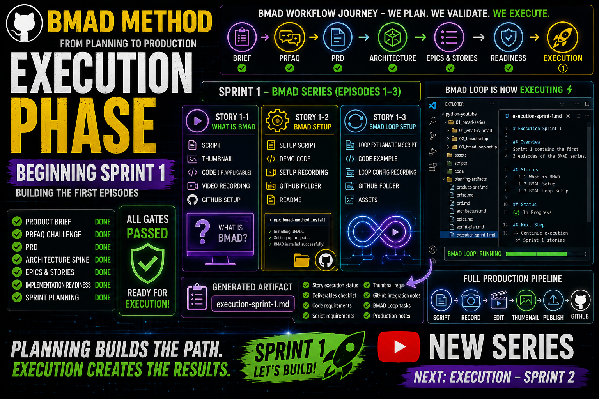

# BMAD Execution Phase
## VIDEO SCRIPT: BMAD Execution Phase — Beginning Sprint 1 (Building the First Episodes)

**Duration:** ~15-16 minutes
**Teleprompter Script:** Full video script
**Target Audience:** Developers ready to start producing their series

---

## 🎯 INTRO

"Welcome back! In the last videos we completed the entire BMAD planning workflow: Product Brief, PRFAQ, PRD, Architecture Spine, Epics & Stories, Implementation Readiness, and Sprint Planning.

Today we're entering the **Execution Phase** — where we actually begin producing the episodes defined in Sprint 1.

---

## 📋 SECTION 1 — What BMAD-help Told Us

"BMAD-help confirmed that all validation gates passed and that the project is fully ready for execution.

It also explained that Execution is where:

- Stories become real episodes
- Code gets written
- Scripts get finalized
- Videos get recorded
- Thumbnails get designed
- GitHub gets updated
- The BMAD Loop begins running development tasks

This is the phase where planning becomes production."

---

## 🤖 SECTION 2 — Opening the BMAD Agent

"To run BMAD skills, we open the BMAD Agent in VS Code.

Press **Ctrl + Shift + P** (or **Cmd + Shift + P** on Mac), type **BMAD: Launch Agent**, and select any agent.

All agents share the same loop, so it doesn't matter which one you open."

---

## ⚙️ SECTION 3 — Starting Execution for Sprint 1

"In the BMAD Agent Chat, type exactly:

```text
use the bmad-execute-sprint skill
```

BMAD will now begin executing the stories assigned to Sprint 1.

---

## 📊 SECTION 4 — Sprint 1 Breakdown (BMAD Series)

"Here's what Sprint 1 contains — and what execution will produce for each story."

### **Story 1-1: What is BMAD**

**Deliverables:**
- ✅ Episode script
- ✅ Thumbnail design spec
- ✅ Code (starter template)
- ✅ Video recording
- ✅ GitHub folder setup

"This is the foundation episode. It explains BMAD to complete beginners."

### **Story 1-2: BMAD Setup**

**Deliverables:**
- ✅ Script explaining installation
- ✅ Demo code (verification script)
- ✅ Recording of setup process
- ✅ GitHub folder + README

"This teaches viewers how to set up BMAD on their machine."

### **Story 1-3: BMAD Loop Setup**

**Deliverables:**
- ✅ Script explaining the loop
- ✅ Code example
- ✅ Recording of loop configuration
- ✅ GitHub folder + assets

"This shows how to activate BMAD's automation engine."

**Summary:**
"These three stories form the **complete foundation** of the BMAD series."

---

## 📁 SECTION 5 — What Execution Produces

"BMAD will generate a new artifact inside your project folder.

Open the file in VS Code, for example:

```
_bmad-output/planning-artifacts/execution-sprint-1.md
```

This document contains:

- Story execution status
- Deliverables checklist for each story
- Code requirements
- Script requirements
- Thumbnail requirements
- GitHub integration notes
- BMAD Loop tasks
- Production notes for each episode

---

## 🎯 SECTION 6 — What Comes Next

"After Sprint 1 is executed, the next BMAD steps are:

Sprint 2 → Sprint 3 → Real Projects → Crypto → Tutorials → Shorts

In the next video, we'll continue with Sprint 2 of the BMAD series.

---

## 🎉 SECTION 7 — Recap & Recap & Next Video

"Quick recap:

✅ We completed the entire planning phase  
✅ We validated everything with Implementation Readiness  
✅ We organized all stories into sprints  
✅ And today we began executing Sprint 1  

Next video: Execution — Sprint 2 of the BMAD series.

If this helped you, leave a like and subscribe. And tell me in the comments what BMAD topic you want next!"

---

## 📌 Timestamps (for YouTube description)

- 00:00 – Intro
- 01:10 – What BMAD-help told us
- 01:45 – Opening the BMAD Agent
- 02:20 – Running Execution
- 06:10 – Sprint 1 breakdown
- 12:00 – Reviewing execution-sprint-1.md
- 12:35 – What comes next
- 15:30 – Recap & next video

---

## Resources & Links

- Official BMAD GitHub: [BMAD GitHub](https://github.com/bmad-code-org/BMAD-METHOD)
- **GitHub Repository:** [YTlearning GitHub Repository](https://github.com/NexusBT2026/YTlearning.git)
- **YouTube Channel:** [YTlearning YouTube Channel](https://www.youtube.com/channel/UCClukBkgrmBj7svPIrMqvDg)

---

## Key Takeaways

1. **Execution Phase** = Where stories become deliverables
2. **Sprint Execution** = BMAD runs all stories in a sprint at once
3. **Deliverables** = Scripts, code, assets, documentation for each story
4. **Production Checklist** = BMAD's artifact shows what's done and left
5. **Your Role** = Record videos, create thumbnails, publish to YouTube
6. **Next Sprint** = Run execution again for Sprint 2, 3, etc.

---

## Requirements:

- BMAD installed
- BMAD Loop setup (Story 1-3)
- Product Brief, PRFAQ, PRD completed (Stories 1-4, 1-5)
- Architecture Spine completed (Story 1-6)
- Epics & Stories completed (Story 1-7)
- Implementation readiness completed (Story 1-8)
- Sprint Planning completed (Story 1-9)
- VS Code BMAD Agent



