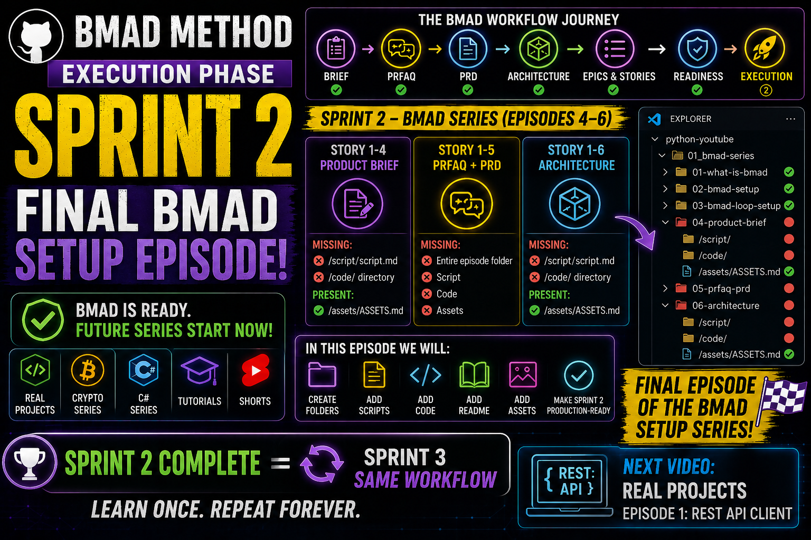

# BMAD Execution Phase
## VIDEO SCRIPT: BMAD Execution Phase — Final Setup (Building Sprint 2 Episodes)

**Duration:** ~15-16 minutes
**Teleprompter Script:** Full video script
**Target Audience:** Developers ready to start producing their series

---

## 🎯 INTRO

"Welcome back! In the last video we began the Execution Phase and completed Sprint 1 of the BMAD series.

Today we're continuing with Sprint 2 — and this will be the final episode of the BMAD setup series.

Why? Because Sprint 3 follows the exact same workflow as Sprint 2.
So instead of repeating the same steps, I'll show you how Sprint 2 works — and from here, you can apply the same process to Sprint 3."

---

## 📋 SECTION 1 — What BMAD-help told us

"BMAD-help analyzed Sprint 2 and showed that the stories are at-risk because the episode folders and files still need to be created."

"It also gave us two options:

Option A: Populate Sprint 2 folders with content from the story files

Option B: Skip Sprint 2 and execute Sprint 3
We're choosing Option A, because Sprint 2 contains important planning episodes."

---

## 🤖 SECTION 2 — Opening the BMAD Agent

"To run BMAD skills, we open the BMAD Agent in VS Code."

"Press Ctrl + Shift + P, type BMAD: Launch Agent, and select any agent."

"All agents share the same loop, so it doesn't matter which one you open."

---

## ⚙️ SECTION 3 — Starting Execution for Sprint 2

"In the BMAD Agent Chat, type exactly:"

```
use the bmad-execute-sprint skill
```

"BMAD will now begin executing the stories assigned to Sprint 2."

---

## 📊 SECTION 4 — Sprint 2 Breakdown (BMAD Series)

"Here's what Sprint 2 contains."

**Story 1‑4 — Product Brief**
- Missing: /script/script.md, /code/ directory
- Present: /assets/ASSETS.md

**Story 1‑5 — PRFAQ + PRD**
- Missing: Entire episode folder, Script, Code, Assets

**Story 1‑6 — Architecture**
- Missing: /script/script.md, /code/ directory
- Present: /assets/ASSETS.md

"These three stories complete the planning episodes of the BMAD series."

---

## 📁 SECTION 5 — What We Do in This Episode

"In this video, we will:

- Create the missing episode folders
- Add the script files
- Add the code folders
- Add the README files
- Add the assets
- Make Sprint 2 fully production-ready

Once Sprint 2 is complete, Sprint 3 follows the exact same steps — so you can repeat the process without needing another video."

---

## 🚀 SECTION 6 — Why This Is the Final BMAD Setup Episode

"This episode completes the BMAD setup series."

"From now on, BMAD becomes the engine behind all future content:

- Real Projects series
- Crypto series
- C# series
- Tutorials
- Shorts

We won't make more BMAD setup videos — instead, we'll use BMAD to build every future project."

---

## 🎯 SECTION 7 — What Comes Next

"The next video will be on the Real Projects channel, where we start building real Python projects using the BMAD workflow."

"BMAD is now fully configured, validated, and ready to support every series."

---

## 🎉 SECTION 8 — Recap & Next Video

"Quick recap:
Sprint 2 is the final BMAD setup episode.
Sprint 3 follows the same workflow, so you can repeat the steps yourself.
From now on, BMAD will be used to build all future series."

"Next video: Real Projects — Episode 1: REST API Client."

If this helped you, leave a like and subscribe. And tell me in the comments what BMAD topic you want next.

---

## 📌 Timestamps

- 00:00 – Intro
- 00:35 – What BMAD-help told us
- 01:30 – Opening the BMAD Agent
- 02:00 – Starting Execution for Sprint 2
- 03:20 – Sprint 2 Breakdown (BMAD Series)
- 04:20 – What We Do in This Episode
- 13:50 – Why This Is the Final BMAD Setup Episode
- 14:20 – What Comes Next
- 15:00 – Recap & Next Video

---

## Resources & Links

- Official BMAD GitHub: [BMAD GitHub](https://github.com/bmad-code-org/BMAD-METHOD)
- **GitHub Repository:** [YTlearning GitHub Repository](https://github.com/NexusBT2026/YTlearning.git)
- **YouTube Channel:** [YTlearning YouTube Channel](https://www.youtube.com/channel/UCClukBkgrmBj7svPIrMqvDg)

---

## Key Takeaways (Story 1-11: Sprint 2 Execution)

1. **Sprint 2 = Planning Phase Completion** — Stories 1-4, 1-5, 1-6 complete all planning episodes
2. **bmad-execute-sprint Automation** — Generates scripts, code, assets, and documentation automatically
3. **Three Stories to Execute** — Product Brief (1-4), PRFAQ + PRD (1-5), Architecture (1-6)
4. **Production Artifacts** — Execution report + production checklist for each story
5. **Same Pattern Repeats** — Sprint 3 and beyond follow identical workflow
6. **BMAD is Now the Engine** — From Sprint 3 onward, use BMAD for all content production

---

## Requirements (Story 1-11):

- BMAD installed and configured
- BMAD Loop setup completed (Story 1-3)
- All prior planning phase stories completed (Stories 1-1 through 1-10)
- VS Code with BMAD Agent
- Sprint 2 episode folders created (1-4, 1-5, 1-6)
- access to `_bmad-output/implementation-artifacts/stories/` for story files
- Recording equipment for video production


