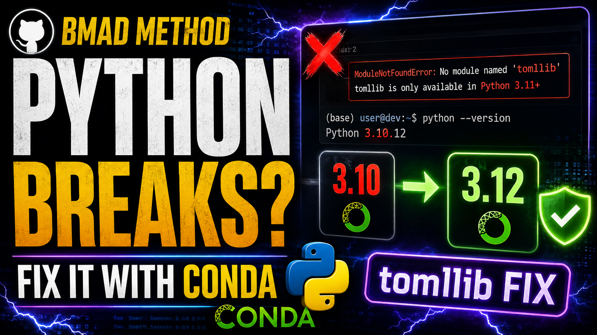

# Python Version Upgrade — Full Video Script

**Video Title:** Why Your Python Code Breaks (And How to Fix It with Conda)

**Duration:** ~8-10 minutes  
**Target Audience:** Python developers running Python 3.10 who need to upgrade

---

## 🎯 INTRO

"Welcome back! In the last video we completed the BMAD Execution Phase of sprint two.

Now while browsing through some files, I noticed something peculiar: In two of the scripts, there were references to `tomllib`, which is only available in Python 3.11 and above. 

"Picture this: You download the latest script for your project, you run it, and boom—your terminal throws a massive error. It says: Python 3.11+ is required (stdlib tomllib not found). You check your version, and you're running Python 3.10. Suddenly, your entire workflow grinds to a halt.

**The Context:** 

"This isn't a hypothetical situation. I was recently working inside my YTlearning project folder, trying to run our configuration scripts, when I hit this exact wall. Today, I'm going to show you exactly why this happens, how to read these upgrade warnings, and how to use Conda to instantly fix your environment without breaking anything else."

---

## 1️⃣ SECTION 1: Why the Upgrade Happened (The tomllib Shift)

"So, what caused this crash? It all comes down to a core file in our architecture: _bmad\scripts\resolve_customization.py (which works alongside _bmad\scripts\resolve_config.py).

These scripts manage our four-layer TOML configuration files. They read your team settings, your personal overrides, and your default skills, then merge them beautifully.

To keep our project incredibly lean, these scripts use zero third-party dependencies. Instead, they rely on a built-in Python library called tomllib to read those configuration files.

Here is the catch: tomllib was introduced in Python 3.11. If you are running Python 3.10 or older, that library literally does not exist in your Python installation, causing the script to fail. As our project standardizes on modern tools like uv run, having Python 3.11 or higher is no longer optional—it's a requirement."

---

## 2️⃣ SECTION 2: The Golden Rule of Upgrading

"Now, before you go pushing buttons to upgrade, you need to know one crucial rule:

**How you upgrade depends entirely on how you manage your environments.**

If you aren't careful, you can ruin your workspace.

### Standard Venv Users

If you use standard Python virtual environments, you cannot upgrade them in place. You have to export your packages using `pip freeze`, delete the environment, install Python 3.11 globally, create a fresh env, and reinstall everything. It's a chore.

### Poetry Users

Poetry users have to modify their `pyproject.toml` file to target `^3.11` and explicitly tell Poetry to switch interpreters.

### Global Users

Global users have to go hunt down installers for Windows, Mac, or Linux."

---

## 3️⃣ SECTION 3: The Conda Superpower (Live Demo)

"But if you've been following this channel, you know we use Conda for everything.

And this is where Conda absolutely shines. Conda treats Python itself as a package, meaning we can upgrade the engine of our environment in-place with a single command.

Let's look at my terminal right here in our YTlearning folder. I am currently inside my `bmad-python` environment. When I check my version by running `python --version`, you can see I am on Python 3.10.20—which is exactly why our customization script is throwing errors.

Because we want to future-proof this setup, we aren't just going to 3.11—we are going straight to Python 3.12. Watch how clean this is. We type:"

### Command:

```powershell
conda install python=3.12
```

"Conda analyzes the environment and hands us a clean Package Plan. It shows you exactly what it's about to modify. It handles a 16.6 MB download, safely updates Python from 3.10.20 to 3.12.13, and automatically adjusts core packaging tools like setuptools and wheel so they don't break.

We hit `y` for yes, let it run its transaction, and just like that, our environment's core Python version is modernized."

### Verify:

#### 🐧 Linux / macOS / WSL
```bash
python --version
```

#### 🪟 Windows PowerShell
```powershell
python --version
```

#### 🪟 Windows CMD
```cmd
python --version
```

"You'll see the output is now `Python 3.12.13` or higher."

---

## 4️⃣ SECTION 4: The Clean-Up Step

"Now, there is one final, mandatory step whenever you do an in-place upgrade like this.

You need to make sure all your other project libraries are fully compatible with your brand-new Python version. To do that, run:"

### Command:

```powershell
conda update --all
```

"This tells Conda to review every package in `bmad-python` and bump them to their latest versions that match Python 3.12. As you can see on my screen, everything is perfectly aligned, resolved, and ready to roll."

---

## 🎬 OUTRO & CALL TO ACTION

"And that is it! Our _bmad scripts will now execute flawlessly, tomllib will import without issues, and we didn't have to delete our environment or re-clone our project.

If this video saved your project configuration today, smash that Like button, Subscribe to the channel for more clean developer workflows, and drop a comment below if you ran into any dependency issues. I'll see you in the next one!"

---

## 📌 Timestamps
- 00:00 – Intro: The Sudden Crash
- 01:38 – Why the Upgrade Happened (The tomllib Shift)
- 03:00 – The Golden Rule of Upgrading
- 04:18 – The Conda Superpower (Live Demo)
- 07:17 – The Clean-Up Step (conda update --all)
- 08:27 – Outro & Call to Action

---

## Key Takeaways (Story 1-12: Python Version Upgrade)

1. **tomllib is Python 3.11+ Only** — Built-in TOML library that doesn't exist in Python 3.10 or earlier
2. **How You Upgrade Matters** — venv, Poetry, global, and Conda each require different approaches
3. **Conda's Superpower** — Treats Python as a package, allowing safe in-place version upgrades
4. **Two-Step Process** — Install new Python version, then run `conda update --all` for full compatibility
5. **No Environment Deletion** — Unlike venv, Conda preserves your entire environment during upgrade
6. **Future-Proofing Strategy** — Upgrading to 3.12 ensures compatibility with modern tools and libraries

---

## Requirements (Story 1-12):

- Conda/Anaconda installed and configured
- Active Conda environment (bmad-python or equivalent)
- Python 3.10 or older currently installed in the environment
- Terminal/command line access (PowerShell, Bash, or Zsh)
- Internet connection for downloading Python 3.12 packages
- Story 1-11 completed (context on BMAD execution phase)
- VS Code or preferred code editor
- Recording equipment for video production




