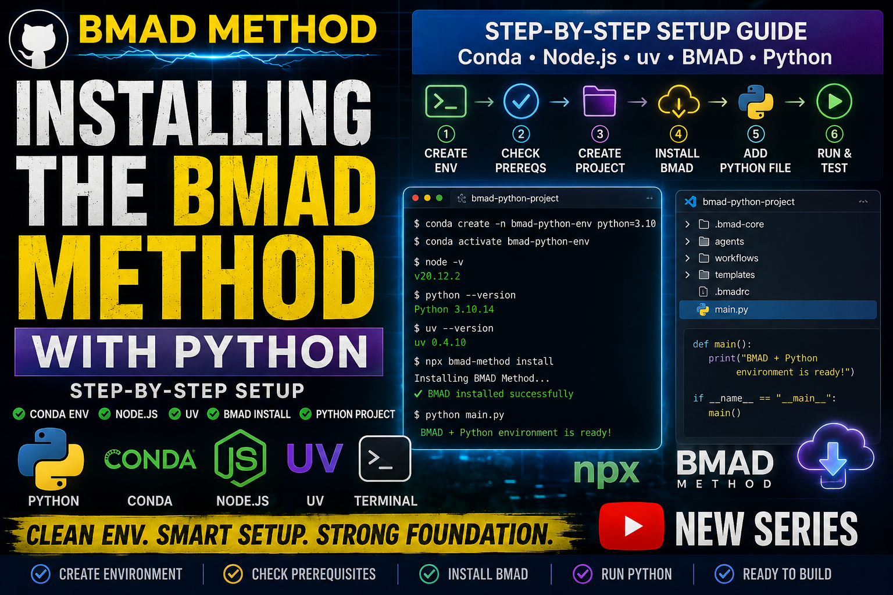

# BMAD Setup — Full Video Script

**Video Title:** Installing the BMAD Method with Python

**Duration:** ~8-9 minutes  
**Target Audience:** Python developers ready to install BMAD

---

## 🎯 INTRO

"Welcome back! In the last video we learned what BMAD is and why it matters.

Today I'm going to show you, step by step, how to install the BMAD Method on your machine and use it with Python.

We'll create a clean Conda environment, check all prerequisites, and then install BMAD into a new project folder.

This is beginner‑friendly but still technical enough so you understand what you're actually building."

---

## 1️⃣ SECTION 1: Creating a New Conda Environment

"First, we're going to create a fresh Conda environment for this BMAD + Python project.

This keeps everything isolated and clean, so we don't break other projects."

### Commands:

#### 🐧 Linux / macOS / WSL
```bash
conda create -n bmad-python python=3.10
```

#### 🪟 Windows PowerShell
```powershell
conda create -n bmad-python python=3.10
```

#### 🪟 Windows CMD
```cmd
conda create -n bmad-python python=3.10
```


#### 🐧 Linux / macOS / WSL
```bash
conda activate bmad-python
```

#### 🪟 Windows PowerShell
```powershell
conda activate bmad-python
```

#### 🪟 Windows CMD
```cmd
conda activate bmad-python
```

**Explanation:**

"We're calling this environment `bmad-python` and we're explicitly using Python 3.10, because BMAD requires Python 3.10 or higher.

Activating the environment makes sure every package we install now stays inside this project, isolated from your system Python."

---

## 2️⃣ SECTION 2: Checking Prerequisites

"BMAD has three main prerequisites: Node.js 20.12 or higher, Python 3.10 or higher, and uv as the Python package manager.

Let's check each one inside this environment."

### Commands:

#### 🐧 Linux / macOS / WSL
```bash
node -v
```

#### 🪟 Windows PowerShell
```powershell
node -v
```

#### 🪟 Windows CMD
```cmd
node -v
```
#### 🐧 Linux / macOS / WSL
```bash
python --version
```

#### 🪟 Windows PowerShell
```powershell
python --version
```

#### 🪟 Windows CMD
```cmd
python --version
```
#### 🐧 Linux / macOS / WSL
```bash
uv --version
```

#### 🪟 Windows PowerShell
```powershell
uv --version
```

#### 🪟 Windows CMD
```cmd
uv --version
```

**Explanation:**

"If `node -v` shows version 20.12 or higher, you're good.

`python --version` should show 3.10 or above—if you followed the Conda step, that's already fine.

If `uv --version` gives an error, we need to install it. I'm using pip inside the Conda environment to install uv."

### Install uv (if needed):

📦 Windows / macOS / Linux (pip)
```bash
pip install uv
uv --version
```

🐧 Linux/macOS note
```bash
pip3 install uv
uv --version
```

"Once `uv --version` works, all three prerequisites are ready."

---

## 3️⃣ SECTION 3: Creating the Project Folder

"Now we'll create a new folder for our BMAD + Python project.

This is where BMAD will install its workflows and where we'll write our Python code."

### Commands:

📁 Linux / macOS / WSL
```bash
mkdir YTlearning
cd YTlearning
code .
```

🪟 Windows PowerShell (full)
```powershell
New-Item -ItemType Directory -Path YTlearning
cd YTlearning
code .
```

📄 Or shorter (PowerShell alias)
```powershell
md YTlearning
cd YTlearning
code .
```

📄 Or safe (no error if exists)
```powershell
if (!(Test-Path "YTlearning")) { md YTlearning }
cd YTlearning
code .
```

📄 Windows CMD
```cmd
mkdir YTlearning
cd YTlearning
code .
```


**Explanation:**

I'm calling it `YTlearning`, but you can use any name you like.

`code .` opens this folder in VS Code so we can work comfortably.

On Windows, `md` is a faster alias for `New-Item -ItemType Directory`. All three PowerShell versions do the same thing — just pick whichever is easiest for you to type."

💡 Tip: Linux uses `mkdir`, Windows PowerShell can use `New-Item`, `md`, or chain commands with `;` — just pick what feels comfortable.

---

## 4️⃣ SECTION 4: Installing BMAD in the Project

"With the folder ready and the environment active, we can now install the BMAD Method directly into this project."

### Commands:

#### 🐧 Linux / macOS / WSL
```bash
npx bmad-method install
```

#### 🪟 Windows PowerShell
```powershell
npx bmad-method install
```

#### 🪟 Windows CMD
```cmd
npx bmad-method install
```

### Or for prerelease:

#### 🐧 Linux / macOS / WSL
```bash
npx bmad-method@next install
```

#### 🪟 Windows PowerShell
```powershell
npx bmad-method@next install
```

#### 🪟 Windows CMD
```cmd
npx bmad-method@next install
```

**Explanation:**

"This command downloads BMAD, sets up the configuration, and prepares the workflows.

BMAD will ask a few questions about which modules and tools you want to use.

For a simple Python setup, you can start with the core workflows and your preferred AI IDE or editor.

The important part is: BMAD is now installed inside this folder and ready to guide your development."

---

## 5️⃣ SECTION 5: Creating Your First Python File

"Let's add a simple Python file so we can see how BMAD fits into a real project."

### Create main.py:

```python
def main():
    print("BMAD + Python environment is ready!")

if __name__ == "__main__":
    main()
```

### Run in terminal:

📦 All platforms (once in Conda environment)
```bash
python main.py
```

🐧 Linux/macOS alternative
```bash
python3 main.py
```

**Explanation:**

"This is just a basic script, but the point is: we now have a clean Conda environment, BMAD installed, and a Python project that can grow using BMAD's workflows."

---

## 6️⃣ SECTION 6: Quick Recap & What's Next

"Quick recap:

We created a Conda environment with Python 3.10, checked Node.js and uv, created a project folder, installed BMAD, and added a simple Python script.

In the next video, we'll go deeper into how BMAD's workflows actually help us design, plan, and build real Python applications—step by step."

---

## 📌 Timestamps

- 00:00 – Intro
- 00:25 – Creating a Conda environment for BMAD + Python
- 01:45 – Checking prerequisites: Node.js, Python, uv
- 03:10 – Creating the project folder and opening VS Code
- 04:00 – Installing the BMAD Method in the project
- 07:28 – Creating and running the first Python file
- 08:42 – Recap and what's next

---

## Resources & Links

- Official BMAD GitHub: [BMAD GitHub](https://github.com/bmad-code-org/BMAD-METHOD)
- **GitHub Repository:** [YTlearning GitHub Repository](https://github.com/NexusBT2026/YTlearning.git)
- **YouTube Channel:** [YTlearning YouTube Channel](https://www.youtube.com/channel/UCClukBkgrmBj7svPIrMqvDg)
- **Next Episode:** Story 1-3 (BMAD Loop Setup)

---

## Requirements:
- BMAD installed
- Node.js installed
- Python 3.10 installed
- Conda installed

---


