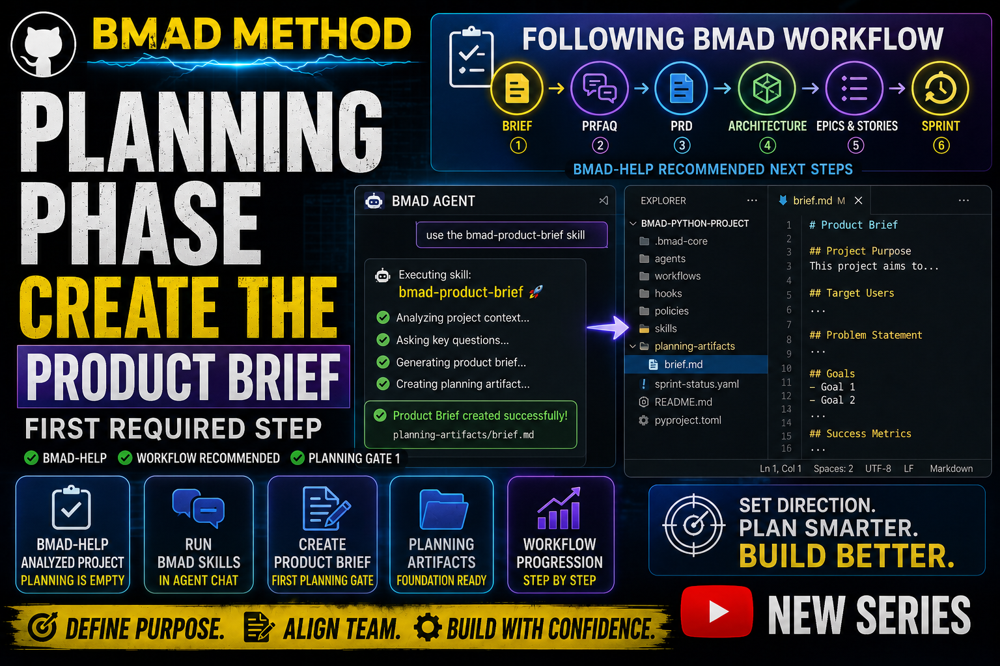

# Story 1-4: Product Brief (BMAD Planning Phase)

**Video Duration:** 13-14 minutes
**Status:** Ready to Record

---

## YouTube Title

"BMAD Planning Phase — Creating the Product Brief (First Required Step)"

---

## VIDEO SCRIPT

### 🎬 INTRO

Welcome back! In the last video we completed the BMAD Loop setup and activated the automation engine.

Today we're moving into the planning phase — because BMAD-help analyzed our project and told us that our planning artifacts are still empty.

So the next required step is to create a Product Brief using the bmad-product-brief skill.

---

### 📊 SECTION 1: What BMAD-help Told Us

BMAD-help looked at our project and gave us a full list of recommended next steps.

It said the first planning gate is the Product Brief, followed by PRFAQ, PRD, Architecture, Epics, Implementation Readiness, and Sprint Planning.

So today we'll generate the Product Brief — the foundation of the entire BMAD workflow.

---

### 🔧 SECTION 2: Opening the BMAD Agent

To run BMAD skills, we need to open the BMAD Agent in VS Code.

Press Ctrl + Shift + P, type "BMAD: Launch Agent", and select one of the agents, for example:
- bmad-agent-dev
- bmad-agent-architect
- bmad-agent-pm

All agents share the same loop, so it doesn't matter which one you open.

---

### ⚙️ SECTION 3: Running the Product Brief Skill

Now that the agent chat is open, we can run the skill BMAD recommended.

In the BMAD Agent Chat, type exactly:

```
use the bmad-product-brief skill
```

BMAD will now start the Product Brief workflow and ask several questions about our project.

---

### 📋 SECTION 4: Answering the Product Brief Questions

BMAD is asking me eight questions to build a comprehensive Product Brief.

**Question 1: What is the name of the project?**

Answer: "Python YouTube Series — Real Projects for Beginners."

**Question 2: Who is this project for?**

Answer: "Beginners and intermediate developers who want to learn Python through real, practical projects instead of basic tutorials."

**Question 3: What problem does this project solve?**

Answer: "Most Python tutorials only teach syntax and simple examples. Beginners struggle to build real projects and understand how Python is used in actual development."

**Question 4: What does the product do in one sentence?**

Answer: "A practical Python video series that teaches real development through mini-projects, APIs, websockets, ML basics, and useful tools."

**Question 5: What are the key features?**

Answer: "Realistic mini-projects, API usage, websocket clients, ML basics, logging, error-handling, and beginner-friendly explanations."

**Question 6: What is out of scope for version 1?**

Answer: "No advanced machine learning, no private trading systems, and no paid or proprietary code."

**Question 7: What are the success criteria?**

Answer: "Viewers can build real Python projects, understand how to structure code, and gain confidence to create their own tools."

**Question 8: Why does this project exist?**

Answer: "To help beginners learn Python the way real developers use it — through practical, useful projects instead of basic syntax tutorials."

Once we've answered these questions, BMAD has enough context to generate the Product Brief.

---

### 📂 SECTION 5: Reviewing the Generated Brief

BMAD will create a new planning artifact inside our project folder.

Let's open it and review what BMAD generated.

Open the file in VS Code, for example:

```
/planning-artifacts/brief.md
```

This document becomes the foundation for the PRFAQ, PRD, architecture, and epics.

Here's what it contains:
- Project name and vision
- Target audience
- Problem statement
- Solution summary
- Key features
- Out of scope items
- Success criteria
- Why the project exists

---

### 🔮 SECTION 6: What Comes Next

BMAD-help also told us the next steps:

PRFAQ → PRD → Architecture → Epics → Implementation Readiness → Sprint Planning.

In the next video, we'll continue with the PRFAQ challenge — a stress test for our project idea.

The PRFAQ (Press Release / FAQ) is a working-backwards document where we imagine our product is already complete, and we write the press release.

Then we create an FAQ to handle all anticipated objections.

This pressure-tests our idea before we invest in a full PRD.

---

### ✅ SECTION 7: Recap & Next Video

Quick recap:

BMAD-help analyzed our project, told us the planning phase was empty, and recommended creating a Product Brief.

We opened the BMAD Agent, ran the bmad-product-brief skill, answered the questions, and generated our first planning artifact.

The brief became the foundation for all upcoming BMAD phases:
- PRFAQ
- PRD
- Architecture
- Epics & Stories
- Implementation Readiness
- Sprint Planning

Next video: BMAD PRFAQ + PRD — Stress-testing and defining your project.

If this helped you understand BMAD planning, leave a like and subscribe.

And tell me in the comments: What project would you use BMAD for first?

See you in the next video!

---

## 📌 Timestamps

- 00:00 – Intro
- 00:30 – What BMAD-help told us
- 01:06 – Opening the BMAD Agent
- 01:36 – Running the bmad-product-brief skill
- 02:40 – Answering the brief questions
- 09:45 – Reviewing the generated brief
- 11:00 – What comes next
- 13:30 – Recap & next video

---

## Resources & Links

- Official BMAD GitHub: [BMAD GitHub](https://github.com/bmad-code-org/BMAD-METHOD)
- **GitHub Repository:** [YTlearning GitHub Repository](https://github.com/NexusBT2026/YTlearning.git)
- **YouTube Channel:** [YTlearning YouTube Channel](https://www.youtube.com/channel/UCClukBkgrmBj7svPIrMqvDg)
- **Next Episode:** Story 1-5 (BMAD PRD + PRFAQ)

---

## Requirements:

- BMAD installed (Story 1-1 and 1-2)
- BMAD Loop setup completed (Story 1-3)
- VS Code BMAD Agent
- Python + uv environment

---


