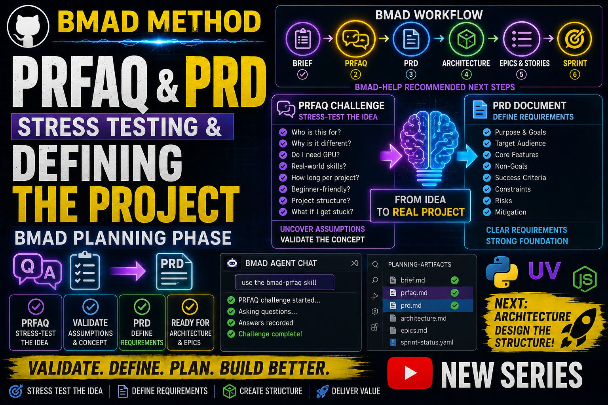

# Story 1-5: PRFAQ + PRD (BMAD Planning Phase)

**Video Duration:** 15-16 minutes
**Status:** Done

---

## YouTube Title

"BMAD Planning Phase — PRFAQ + PRD (Stress-Testing and Defining the Project)"

---

## VIDEO SCRIPT

### 🎬 INTRO

Welcome back! In the last video we created the Product Brief for our Python YouTube project.

BMAD-help analyzed our project and told us that the next step is to stress-test the idea using the PRFAQ challenge — and then define the requirements using the PRD.

Today we're doing both: PRFAQ and PRD.

This is a longer episode (15-16 minutes) because we're covering two important planning phases.

---

### 📊 SECTION 1: What BMAD-help Told Us

BMAD-help gave us three possible paths forward:

**Path 1: PRFAQ Challenge (Recommended)**
- Stress-test the idea by answering customer questions
- Surface hidden assumptions
- Validate the concept
- Takes 30–60 minutes

**Path 2: PRD (Fast Track)**
- Skip PRFAQ
- Go straight to detailed requirements
- Required before Architecture and Epics

**Path 3: Multi-Agent Expert Review**
- Product brief coach
- Market analyst
- Storyteller
- Good for refining the concept

BMAD-help recommended PRFAQ first — and that's what we're doing.

---

### 🔧 SECTION 2: Opening the BMAD Agent

To run BMAD skills, we open the BMAD Agent in VS Code.

Press Ctrl + Shift + P, type "BMAD: Launch Agent", and select one of the agents.

All agents share the same loop, so it doesn't matter which one you open.

---

### ⚙️ SECTION 3: Running the PRFAQ Skill

In the BMAD Agent Chat, type exactly:

```
use the bmad-prfaq skill
```

BMAD will now start the PRFAQ challenge and ask questions that simulate real customer FAQs.

These questions pressure-test the idea from the perspective of beginners who will watch the Python series.

---

### 📋 SECTION 4: Answering All PRFAQ Questions

BMAD is asking eight key customer questions about the Python YouTube series.

**FAQ 1: Who is this series for?**

Answer: "This series is for beginners and intermediate developers who want to learn Python through real projects instead of basic syntax tutorials."

**FAQ 2: Why should I watch this instead of other Python tutorials?**

Answer: "Most tutorials only teach syntax. This series teaches real development: APIs, websockets, ML basics, logging, error-handling, and practical tools."

**FAQ 3: Do I need advanced hardware like a GPU?**

Answer: "No. All projects are designed to run on any basic laptop. ML basics will be lightweight and CPU-friendly."

**FAQ 4: Will I learn real-world skills?**

Answer: "Yes. Every episode builds something useful — not toy examples."

**FAQ 5: How long does each project take?**

Answer: "Most mini-projects take 10–30 minutes to follow along."

**FAQ 6: Is this series beginner-friendly?**

Answer: "Yes. Every concept is explained step-by-step, with clear structure and no assumptions."

**FAQ 7: Will you show how to structure Python projects?**

Answer: "Yes. The series includes folder structure, modules, error-handling, logging, and clean code practices."

**FAQ 8: What if I get stuck?**

Answer: "Each video includes clear explanations, and the comments section is open for questions."

Once we answer these FAQs, BMAD has enough information to validate the concept.

---

### ✅ SECTION 5: PRFAQ Results

BMAD shows us the PRFAQ summary:

- All customer concerns are addressed
- No hidden assumptions detected
- The concept is validated
- Ready to move to PRD

If there were gaps or red flags, we'd go back and revise the brief. But our Python series is solid.

---

### 📋 SECTION 6: Running the PRD Skill

Now that PRFAQ is complete, we can move to the PRD.

In the BMAD Agent Chat, type:

```
use the bmad-prd skill
```

The PRD defines the detailed requirements for the Python YouTube series.

---

### 📄 SECTION 7: PRD Requirements

The PRD covers:

**1. Purpose**  
Teach Python through real, practical projects instead of basic syntax tutorials.

**2. Target Audience**  
Beginners and intermediate developers.

**3. Core Features**  
- Mini-projects (REST APIs, websockets, data processing, ML basics)
- Practical tools (logging, error-handling, async code)
- Clean code structure
- Step-by-step explanations
- GitHub code examples

**4. Non-Goals**  
- No advanced machine learning
- No private trading systems
- No paid or proprietary code
- No production infrastructure

**5. Success Criteria**  
- Viewers can build real Python projects
- Viewers understand project structure
- Viewers gain confidence to create their own tools

**6. Functional Requirements (What the series does)**
- FR1: Teach Python through realistic mini-projects
- FR2: Show clean code structure and best practices
- FR3: Provide step-by-step video walkthroughs
- FR4: Include working code examples on GitHub
- FR5: Support community engagement through YouTube comments and GitHub issues

**7. Non-Functional Requirements (How well it does it)**
- NFR1: Episode length: 20–30 minutes each
- NFR2: Each episode focuses on ONE concept
- NFR3: No special hardware required (CPU-only)
- NFR4: Open-source with clear licensing
- NFR5: Free to access
- NFR6: Beginner-friendly explanations
- NFR7: Captions and transcripts included
- NFR8: Video and code released simultaneously

**8. Constraints & Risks**
- Constraint: All episodes must be under 30 minutes
- Constraint: No proprietary code
- Risk: Keeping up with consistent release schedule
- Risk: Community support requires active engagement

---

### 🎬 SECTION 8: Recap & Next Video

Quick recap:

We completed the PRFAQ challenge to stress-test our Python YouTube series concept.

We answered eight customer FAQ questions and validated the idea.

We generated the PRD with detailed requirements, features, success criteria, and constraints.

Next video: Architecture — where we design the operational backbone of the series.

The Architecture Spine will define:
- How videos are structured
- Folder layout in GitHub
- Episode naming conventions
- Community engagement model

If this helped you understand planning phases, leave a like and subscribe.

Tell me in the comments: What would YOU build using BMAD methodology?

See you in the next video!

---

## YouTube Description

**In this video, we complete two critical BMAD planning phases: PRFAQ and PRD.**

After creating the Product Brief (Episode 1-4), the next step is to stress-test the idea with a PRFAQ challenge and then document detailed requirements with a PRD.

**PRFAQ (Press Release + FAQ):**
- Answers eight customer FAQ questions about the Python YouTube series
- Validates the concept from a user's perspective
- Surfaces hidden assumptions
- Informs the PRD

**PRD (Product Requirements Document):**
- Defines purpose, audience, features, and success criteria
- Specifies Functional Requirements (what the series does)
- Specifies Non-Functional Requirements (quality standards)
- Identifies constraints and risks

**In this video, I show:**
- How to run the bmad-prfaq skill in BMAD Agent Chat
- How to answer all 8 customer FAQ questions
- How to interpret PRFAQ results
- How to run the bmad-prd skill
- The complete PRD for the Python YouTube series
- How PRD feeds into Architecture and Epics

**Next video:**
BMAD Architecture — Designing the Series Foundation

## 📌 Timestamps

- 00:00 – Intro
- 00:45 – What BMAD-help told us
- 01:48 – Opening the BMAD Agent
- 02:33 – Running PRFAQ
- 07:05 – Answering PRFAQ questions
- 09:20 – Running PRD
- 10:10 – PRD requirements
- 14:45 – What comes next
- 15:17 – Recap & next video

## Resources & Links

- Official BMAD GitHub: [BMAD GitHub](https://github.com/bmad-code-org/BMAD-METHOD)
- **GitHub Repository:** [YTlearning GitHub Repository](https://github.com/NexusBT2026/YTlearning.git)
- **YouTube Channel:** [YTlearning YouTube Channel](https://www.youtube.com/channel/UCClukBkgrmBj7svPIrMqvDg)
- **Next Episode:** Story 1-6 (BMAD Architecture)

---

## Requirements:

- BMAD installed (Story 1-1 and 1-2)
- BMAD Loop setup completed (Story 1-3)
- BMAD Product Brief created (Story 1-4)
- VS Code BMAD Agent
- Python + uv environment

---


