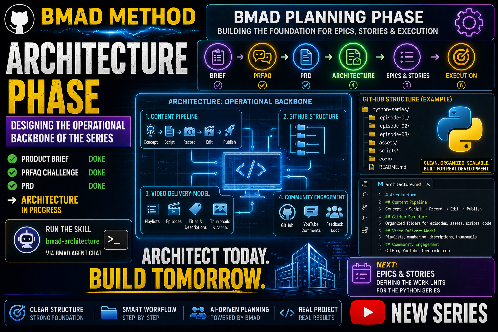

# Story 1-6: Architecture (BMAD Planning Phase)

**Video Duration:** 27-28 minutes
**Status:** Done

---

## YouTube Title

"BMAD Planning Phase — Architecture (Designing the Series Backbone)"

---

## VIDEO SCRIPT

### 🎬 INTRO

Welcome back! In the last video we completed the PRFAQ challenge and created the PRD for our Python YouTube series.

BMAD-help confirmed that all planning artifacts are complete.

Today we're moving into the Architecture phase — the step where we design the operational backbone of the entire series.

---

### 📊 SECTION 1: What BMAD-help Told Us

BMAD-help told us that the Architecture phase defines how the series will be built, structured, and delivered.

It covers four major areas:

**1. Content Pipeline**
- How videos move from concept → scripting → filming → editing → publishing
- Tools and workflows for production
- Quality gates at each stage

**2. GitHub Repository Structure**
- Folder layout for episodes and code
- Organization of scripts, code, assets, documentation
- How episodes map to folders (1-1, 1-2, etc.)

**3. Video Delivery Model**
- How videos reach viewers (YouTube)
- Playlist organization
- Episode progression and linking

**4. Community Engagement Model**
- GitHub Issues for questions
- YouTube comments strategy
- Links between code and videos

The Architecture Spine captures these decisions so all future episodes follow a consistent pattern.

---

### 🔧 SECTION 2: Opening the BMAD Agent

To run BMAD skills, we open the BMAD Agent in VS Code.

Press Ctrl + Shift + P, type "BMAD: Launch Agent", and select one of the agents.

All agents share the same loop, so it doesn't matter which one you open.

---

### ⚙️ SECTION 3: Running the Architecture Skill

In the BMAD Agent Chat, type exactly:

```
use the bmad-architecture skill
```

BMAD will now analyze our PRD and create an Architecture Spine.

This document defines the consistent rules that guide all future episodes.

---

### 📋 SECTION 4: Architecture Decisions

BMAD generates architecture decisions covering:

**AD1: Episode Folder Structure**
- Each episode gets its own folder: /1-bmad-for-python/1-X-episode-name/
- Inside: script/, code/, assets/, README.md
- This pattern repeats for all series
- DECISION: Consistent structure enables automation and scalability

**AD2: Naming Convention**
- Episodes: 1-1, 1-2, 1-3 (epic-episode)
- Stories: 1-1-what-is-bmad (epic-episode-slug)
- Folders: Lowercase with hyphens, include description
- DECISION: Predictable naming enables scripting and discovery

**AD3: Repository Root**
- All episode folders under /1-bmad-for-python/
- Planning artifacts under /_bmad-output/
- Scripts and configuration under /_bmad/
- DECISION: Clear separation of concerns (content vs planning vs infrastructure)

**AD4: Code Organization**
- Each episode has /code/ folder with working examples
- Code directly supports the video narrative
- All code runnable, no pseudo-code or broken examples
- DECISION: Viewers can follow along and run code immediately

**AD5: Documentation Requirements**
- Every episode must have README.md with learning objectives
- Script in /script/script.md (full video text)
- Asset requirements in /assets/ASSETS.md
- DECISION: Complete documentation enables quality and consistency

**AD6: Video Delivery**
- All videos on YouTube playlist (one series per playlist)
- Episodes released in numerical order
- Each video links to previous/next episodes
- Descriptions include GitHub folder links
- DECISION: Clear progression helps viewers follow the series

**AD7: Community Engagement**
- GitHub Issues for episode-specific questions
- YouTube comments section moderated
- Links between code and video descriptions
- DECISION: Multiple channels for support maximize engagement

**AD8: Quality Gates**
- Every episode must pass: script ✓ code ✓ assets ✓ README ✓
- Production checklist before recording
- Quality review after recording
- DECISION: Consistency across 27 stories ensures predictable quality

---

### 🏗️ SECTION 5: Architecture Diagram

BMAD creates a visual representation of the architecture:

```
YouTube Playlist (BMAD Series)
    ├── Story 1-1: What is BMAD?
    ├── Story 1-2: BMAD Setup
    ├── Story 1-3: BMAD Loop Setup
    ├── Story 1-4: Product Brief
    ├── Story 1-5: PRFAQ + PRD
    ├── Story 1-6: Architecture (← You are here)
    ├── Story 1-7: Epics & Stories
    ├── Story 1-8: Implementation Readiness
    ├── Story 1-9: Sprint Planning
    └── Story 1-10: Execution Phase
    ├── Story 1-11: Execution Phase Sprint 1
    ├── Story 1-12: Execution Phase Sprint 2
    └── Story 1-13: Needed Upgrade

Each episode folder (GitHub):
    ├── script/
    │   └── script.md (full video text)
    ├── code/
    │   └── [working code examples]
    ├── assets/
    │   └── ASSETS.md (production checklist)
    ├── README.md (learning guide)
    └── Production artifacts

Planning Artifacts (Shared):
    ├── sprint-status.yaml (tracking)
    ├── Product Brief
    ├── PRFAQ + PRD
    └── Architecture Spine (this document)
```

---

### 🔮 SECTION 6: How Architecture Informs Epics

The Architecture Spine becomes the input to the Epics & Stories phase.

Instead of random development, we now know:
- Each story follows the established pattern
- Each story folder gets script/code/assets/README
- Each story must pass quality gates
- All 27 stories across 8 sprints follow this same backbone

This is why Architecture matters — it prevents inconsistencies and enables scaling.

---

### ✅ SECTION 7: Recap & Next Video

Quick recap:

We completed the Product Brief, PRFAQ, PRD, and now Architecture.

The Architecture Spine defines 8 key decisions about how the series is structured, delivered, and maintained.

Next video: Epics & Stories — where we break down the Python series into 8 sprints of manageable work.

After Architecture, everything becomes actionable.

If this helped you understand technical architecture, leave a like and subscribe.

Tell me in the comments: What architecture pattern would you use for YOUR project?

See you in the next video!

---

## 📌 Timestamps

- 00:00 – Intro
- 00:30 – What BMAD-help told us
- 01:30 – Opening the BMAD Agent
- 01:50 – Running Architecture
- 17:50 – Architecture breakdown
- 23:40 – Reviewing the architecture
- 25:15 – What comes next
- 27:10 – Recap & next video

## Resources & Links

- Official BMAD GitHub: [BMAD GitHub](https://github.com/bmad-code-org/BMAD-METHOD)
- **GitHub Repository:** [YTlearning GitHub Repository](https://github.com/NexusBT2026/YTlearning.git)
- **YouTube Channel:** [YTlearning YouTube Channel](https://www.youtube.com/channel/UCClukBkgrmBj7svPIrMqvDg)

---

## Requirements:

- BMAD installed
- BMAD Loop setup (Story 1-3)
- Product Brief, PRFAQ, PRD completed (Stories 1-4, 1-5)
- VS Code BMAD Agent

---

