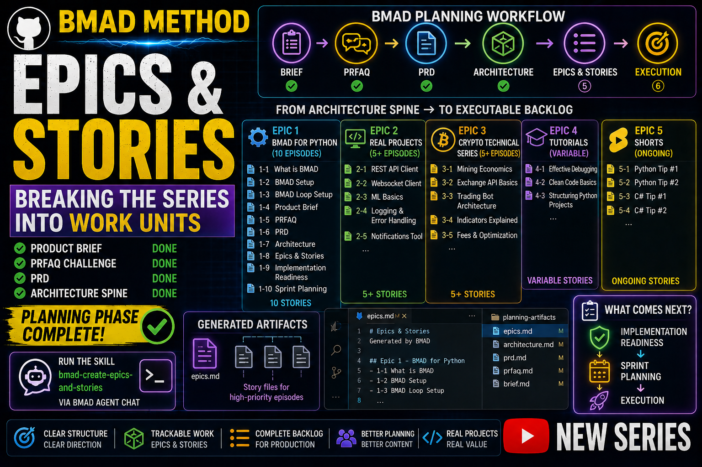

# Story 1-7: Epics & Stories — Breaking Down the Roadmap

**Duration:** 50-51 minutes
**Teleprompter Script:** Full video script with all sections

---

### 🎬 INTRO

“Welcome back! In the last videos we completed the Product Brief, the PRFAQ challenge, the PRD, and the full Architecture Spine.
BMAD-help confirmed that the entire planning phase is now complete.”

“Today we’re moving into the Epics & Stories phase — where we break the entire Python YouTube series into executable work units.”

---

### 📊 SECTION 1: What BMAD-help Told Us

“BMAD-help explained that Epics & Stories take the Architecture Spine and turn it into trackable work.”

“Each series becomes a BMAD Epic.
Each episode becomes a BMAD Story.”

“This creates a complete backlog for production.”

---

### 🔧 SECTION 2: Opening the BMAD Agent

“To run BMAD skills, we open the BMAD Agent in VS Code.”

“Press Ctrl + Shift + P, type BMAD: Launch Agent, and select any agent.”

“All agents share the same loop, so it doesn’t matter which one you open.”

---

### ⚡ SECTION 3: Running the Epics & Stories Skill

“In the BMAD Agent Chat, type exactly:”

```text
use the bmad-create-epics-and-stories skill
```
“BMAD will now generate the epics.md file and create story files for the highest‑priority episodes.”

### 🗺️ SECTION 4: How BMAD Creates Epics & Stories

“Here’s how BMAD will break down the Python YouTube series.”

**Epic 1 — BMAD for Python (10 episodes)**
- Story 1‑1: What is BMAD
- Story 1‑2: BMAD Setup
- Story 1‑3: BMAD Loop Setup
- Story 1‑4: Product Brief
- Story 1‑5: PRFAQ
- Story 1‑6: PRD
- Story 1‑7: Architecture
- Story 1‑8: Epics & Stories
- Story 1‑9: Implementation Readiness
- Story 1‑10: Sprint Planning

**Epic 2 — Real Projects (5+ episodes)**
- Story 2‑1: REST API Client
- Story 2‑2: Websocket Client
- Story 2‑3: ML Basics
- Story 2‑4: Logging & Error Handling
- Story 2‑5: Notifications Tool

**Epic 3 — Crypto Technical Series (5+ episodes)**
- Story 3‑1: Mining Economics
- Story 3‑2: Exchange API Basics
- Story 3‑3: Trading Bot Architecture
- Story 3‑4: Indicators Explained
- Story 3‑5: Fees & Optimization

**Epic 4 — Tutorials (variable)**
- Story 4‑1: Effective Debugging
- Story 4‑2: Clean Code Basics
- Story 4‑3: Structuring Python Projects

**Epic 5 — Shorts (ongoing)**
- Story 5‑1: Python Tip #1
- Story 5‑2: Python Tip #2
- Story 5‑3: C# Tip #1
- Story 5‑4: C# Tip #2

<mark>**"An Epic is a large body of work that can be broken down into smaller stories."**</mark>

For the Python YouTube Series, we have 5 Epics:

**Epic 1: BMAD Foundation**
- 3 stories
- Episodes 1-3 (what we've been creating)
- Duration: 3 hours total

**Epic 2: Real Projects**
- 9 stories
- Episodes 4-12 (building real projects)
- Duration: 20+ hours

**Epic 3: Crypto Series**
- 5 stories
- Episodes 13-17 (blockchain topics)
- Duration: 12+ hours

**Epic 4: Tutorials**
- 4 stories
- Episodes 18-21 (advanced topics)
- Duration: 10+ hours

**Epic 5: Shorts**
- 1+ stories
- Quick educational videos
- Duration: Variable

Each epic has a clear focus and duration estimate."

---

### 📝 SECTION 5: Reviewing the Generated Epics & Stories

“BMAD will create a new planning artifact inside our project folder.”

“Open the file in VS Code, for example:”

```text
_bmad/planning-artifacts/epics.md
```

“And BMAD may generate individual story files for the highest‑priority episodes.”

---

### ⏭️ SECTION 6: What Comes Next

“Now that Epics & Stories are complete, the next BMAD steps are:”

Implementation Readiness → Sprint Planning → Execution

“In the next video, we’ll validate everything with Implementation Readiness.”

---

### ✅ SECTION 7: Recap & Next Video

“Quick recap:
We completed the entire planning phase and generated the Architecture Spine.
Today we broke the entire Python YouTube series into Epics & Stories.”

“Next video: Implementation Readiness — validating the full production pipeline.”

“If this helped you, leave a like and subscribe. And tell me in the comments what BMAD topic you want next.”

---

## 📌 Timestamps

- 00:00 – Intro
- 00:35 – What BMAD-help told us
- 01:00 – Opening the BMAD Agent
- 01:30 – Running Epics & Stories
- 08:30 – Epic breakdown
- 16:35 – Reviewing epics.md
- 50:20 – What comes next
- 50:40 – Recap & next video

## Resources & Links

- Official BMAD GitHub: [BMAD GitHub](https://github.com/bmad-code-org/BMAD-METHOD)
- **GitHub Repository:** [YTlearning GitHub Repository](https://github.com/NexusBT2026/YTlearning.git)
- **YouTube Channel:** [YTlearning YouTube Channel](https://www.youtube.com/channel/UCClukBkgrmBj7svPIrMqvDg)

---

## Requirements:

- BMAD installed
- BMAD Loop setup (Story 1-3)
- Product Brief, PRFAQ, PRD completed (Stories 1-4, 1-5)
- Architecture Spine completed (Story 1-6)
- VS Code BMAD Agent


