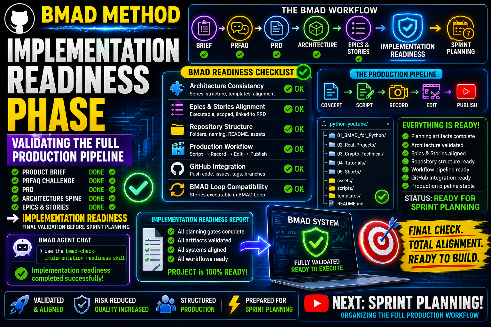

# Story 1-8: Implementation Readiness
## VIDEO SCRIPT: Final Pre-Development Quality Gate

**Duration:** 8-9 minutes
**Teleprompter Script:** Full video script

---

### 🎬 INTRO

“Welcome back! In the last videos we completed the entire BMAD planning phase: the Product Brief, PRFAQ, PRD, Architecture Spine, and Epics & Stories.”

“Today we’re moving into the Implementation Readiness phase — the checkpoint where BMAD validates that everything is aligned before production continues.”

---

### 📊 SECTION 1:   What BMAD-help told us

“BMAD-help confirmed that all planning artifacts are final and production-ready.”

“It also explained that Implementation Readiness ensures that:
- The architecture is consistent
- The epics and stories are executable
- The repository structure is correct
- The production workflow is stable
- The content pipeline is ready for filming and editing
- The GitHub structure supports the upcoming work
- The BMAD Loop can run stories automatically”

“This phase is the final validation before Sprint Planning.”

---

### 🖥 SECTION 2 — Opening the BMAD Agent

“To run BMAD skills, we open the BMAD Agent in VS Code.”

“Press Ctrl + Shift + P, type BMAD: Launch Agent, and select any agent.”

“All agents share the same loop, so it doesn’t matter which one you open.”

---

### ⚡ SECTION 3 — Running the Implementation Readiness Skill

“In the BMAD Agent Chat, type exactly:”

```text
use the bmad-check-implementation-readiness skill
```
“BMAD will now analyze your architecture, epics, stories, and repository structure to confirm everything is ready for production.”

---

### 📝 SECTION 4: What Implementation Readiness Checks

“Here’s what BMAD validates during this phase.”

**Architecture Consistency**
BMAD checks that:
- Series order is correct
- Episode modularity is respected
- Naming conventions are consistent
- Folder structure matches the spine
- Templates are aligned across series

**Epics & Stories Alignment**
BMAD ensures:
- Each series maps to one epic
- Each episode maps to one story
- Stories contain clear learning outcomes
- Stories include code requirements
- Stories link back to the PRD and Architecture

**Repository Structure**
BMAD verifies:
- The python-youtube repo exists
- Series folders are numbered correctly
- Episode folders contain code/, script/, assets/
- README files follow the correct format

**Production Workflow**
BMAD checks:
- Script → recording → editing → publishing pipeline
- Thumbnail workflow
- Description template consistency
- GitHub integration readiness

**GitHub Integration**
BMAD ensures:
- Code can be pushed per episode
- Stories can be exported as GitHub Issues
- Tags or branches can be added later
- Viewer support via GitHub Issues is ready

**BMAD Loop Compatibility**
BMAD confirms:
- Stories can be executed in the BMAD Loop
- Automated development tasks can run
- Future episodes can be scripted automatically

“Once BMAD validates all of this, the project is officially ready for Sprint Planning.”

---

### 🛠 SECTION 5: Reviewing the Implementation Readiness Report

“BMAD will create a new planning artifact inside our project folder.”

“Open the file in VS Code, for example:”

```text
_bmad-output/planning-artifacts/implementation-readiness.md
```
“This document confirms that the entire production pipeline is ready.”

---

### ⏭️ SECTION 6 — What Comes Next

“Now that Implementation Readiness is complete, the next BMAD steps are:”

Sprint Planning → Execution → Publishing

“In the next video, we’ll organize all stories into sprints and prepare the full production schedule.”

### ✅ SECTION 7 — Recap & Next Video

“Quick recap:
We completed the entire planning phase, generated the Architecture Spine, created Epics & Stories, and validated everything with Implementation Readiness.”

“Next video: Sprint Planning — organizing the full production workflow.”

“If this helped you, leave a like and subscribe. And tell me in the comments what BMAD topic you want next.”

---

## 📌 Timestamps

- 00:00 – Intro
- 00:50 – What BMAD-help told us
- 01:30 – Opening the BMAD Agent
- 02:02 – Running Implementation Readiness
- 03:00 – Readiness checks
- 05:40 – Reviewing the report
- 07:30 – What comes next
- 08:00 – Recap & next video

## Resources & Links

- Official BMAD GitHub: [BMAD GitHub](https://github.com/bmad-code-org/BMAD-METHOD)
- **GitHub Repository:** [YTlearning GitHub Repository](https://github.com/NexusBT2026/YTlearning.git)
- **YouTube Channel:** [YTlearning YouTube Channel](https://www.youtube.com/channel/UCClukBkgrmBj7svPIrMqvDg)

---

## Requirements:

- BMAD installed
- BMAD Loop setup (Story 1-3)
- Product Brief, PRFAQ, PRD completed (Stories 1-4, 1-5)
- Architecture Spine completed (Story 1-6)
- Epics & Stories completed (Story 1-7)
- VS Code BMAD Agent


