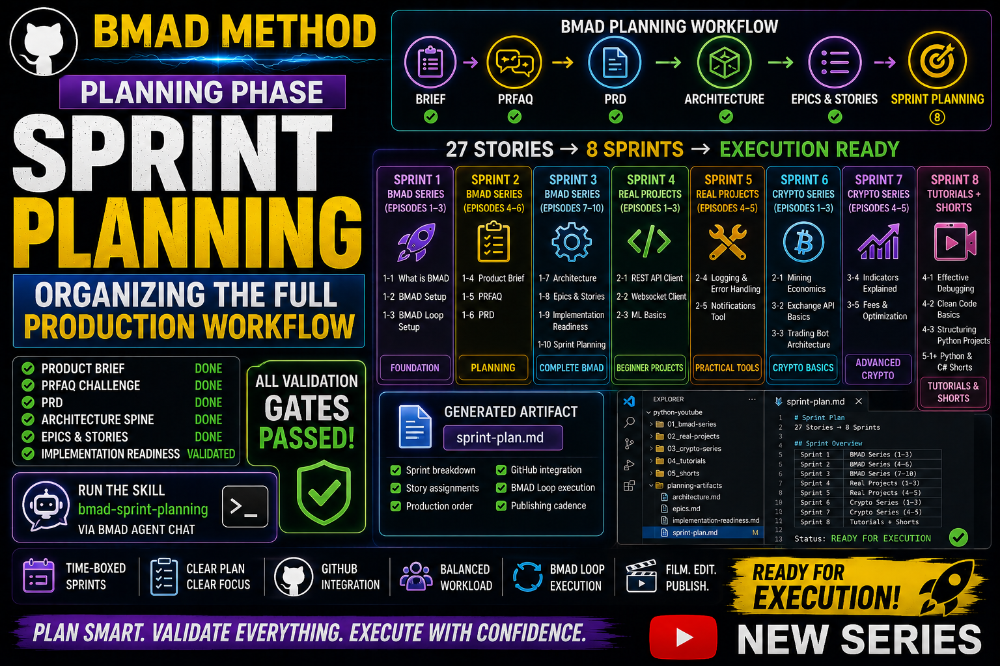

# Story 1-9: Sprint Planning
## VIDEO SCRIPT: Organizing Stories into Sprints

**Duration:** 33-35 minutes  
**Teleprompter Script:** Full video script

---

### 🎬 INTRO

“Welcome back! In the last videos we completed the entire BMAD planning phase: the Product Brief, PRFAQ, PRD, Architecture Spine, Epics & Stories, and the full Implementation Readiness validation.”

“BMAD-help confirmed that all validation gates passed — which means the project is officially ready for Sprint Planning.”

---

### 📊 SECTION 1 — What BMAD-help told us
“BMAD-help explained that Sprint Planning is where we organize all stories into time‑boxed sprints.”

“This phase transforms the epics and stories into a real production schedule:
- What gets filmed first
- What gets edited next
- What gets published
- How the workload is distributed
- How the GitHub workflow aligns with the episodes
- How the BMAD Loop executes development tasks”

“Sprint Planning is the bridge between planning and execution.”

---

### 🖥 SECTION 2 — Opening the BMAD Agent

“To run BMAD skills, we open the BMAD Agent in VS Code.”

“Press Ctrl + Shift + P, type BMAD: Launch Agent, and select any agent.”

“All agents share the same loop, so it doesn’t matter which one you open.”

---

### ⚡ SECTION 3 — Running the Sprint Planning Skill

“In the BMAD Agent Chat, type exactly:”

```text
use the bmad-sprint-planning skill
```
“BMAD will now take your epics.md file and organize all stories into sprints.”

---

### 📝 SECTION 4 — How BMAD Creates Sprints

“Here’s how BMAD will break down the work.”
- Sprint 1 — BMAD Series (Episodes 1–3)
- Story 1‑1: What is BMAD
- Story 1‑2: BMAD Setup
- Story 1‑3: BMAD Loop Setup

Focus: Establishing the foundation of the BMAD series.
- Sprint 2 — BMAD Series (Episodes 4–6)
- Story 1‑4: Product Brief
- Story 1‑5: PRFAQ
- Story 1‑6: PRD

Focus: Completing the planning phase episodes.
- Sprint 3 — BMAD Series (Episodes 7–10)
- Story 1‑7: Architecture
- Story 1‑8: Epics & Stories
- Story 1‑9: Implementation Readiness
- Story 1‑10: Sprint Planning

Focus: Completing the BMAD series.
- Sprint 4 — Real Projects Series (Episodes 1–3)
- Story 2‑1: REST API Client
- Story 2‑2: Websocket Client
- Story 2‑3: ML Basics

Focus: High‑value beginner projects.
- Sprint 5 — Real Projects Series (Episodes 4–5)
- Story 2‑4: Logging & Error Handling
- Story 2‑5: Notifications Tool

Focus: Practical tools and real‑world patterns.
- Sprint 6 — Crypto Series (Episodes 1–3)
- Story 3‑1: Mining Economics
- Story 3‑2: Exchange API Basics
- Story 3‑3: Trading Bot Architecture

Focus: Technical crypto fundamentals.
- Sprint 7 — Crypto Series (Episodes 4–5)
- Story 3‑4: Indicators Explained
- Story 3‑5: Fees & Optimization

Focus: Advanced crypto concepts.
- Sprint 8 — Tutorials + Shorts
- Story 4‑1: Effective Debugging
- Story 4‑2: Clean Code Basics
- Story 4‑3: Structuring Python Projects
- Story 5‑1+: Python & C# Shorts

Focus: Quick educational content and ongoing shorts.

### 🛠 SECTION 5 — Reviewing the Sprint Planning Output

“BMAD will create a new planning artifact inside our project folder.”

“Open the file in VS Code, for example:”

```text
/planning-artifacts/epics.md
```
“This document contains:
- Sprint breakdown
- Story assignments
- Production order
- GitHub integration notes
- BMAD Loop execution plan
- Publishing cadence alignment”

### ⏭️ SECTION 6 — What Comes Next

“Now that Sprint Planning is complete, the next BMAD steps are:”

Execution → Filming → Editing → Publishing

“In the next video, we’ll begin the Execution phase — starting with the first sprint.”

### ✅ SECTION 7 — Recap & Next Video

“Quick recap:
We completed the entire planning phase, validated everything with Implementation Readiness, and organized all 27 stories into sprints.”

“Next video: Execution — beginning Sprint 1 of the BMAD series.”

“If this helped you, leave a like and subscribe. And tell me in the comments what BMAD topic you want next.”

---

## 📌 Timestamps

- 00:00 – Intro
- 00:30 – What BMAD-help told us
- 01:08 – Opening the BMAD Agent
- 01:35 – Running Sprint Planning
- 03:50 – Sprint breakdown
- 16:33 – Reviewing sprint-plan.md
- 31:50 – What comes next
- 33:55 – Recap & next video

## Resources & Links

- Official BMAD GitHub: [BMAD GitHub](https://github.com/bmad-code-org/BMAD-METHOD)
- **GitHub Repository:** [YTlearning GitHub Repository](https://github.com/NexusBT2026/YTlearning.git)
- **YouTube Channel:** [YTlearning YouTube Channel](https://www.youtube.com/channel/UCClukBkgrmBj7svPIrMqvDg)

---

## Requirements:

- BMAD installed
- BMAD Loop setup (Story 1-3)
- Product Brief, PRFAQ, PRD completed (Stories 1-4, 1-5)
- Architecture Spine completed (Story 1-6)
- Epics & Stories completed (Story 1-7)
- Implementation readiness completed (Story 1-8)
- VS Code BMAD Agent


